# Hi there 👋

My name is **Samuel G. Mwangi**

I am a **Full-Stack Developer & Data Engineer** based in Nairobi, Kenya.

I have 4+ years, growing from a **Data Analyst → Data Scientist → Data Engineer**, gaining end-to-end experience in building **scalable web applications, cloud-based systems, and data pipelines**. My expertise spans **React, Node.js, Laravel, and PostgreSQL**, **cloud deployment (AWS, GCP)**, **DevOps practices (CI/CD, Docker, Kubernetes)**, and **data engineering (ETL pipelines, data warehousing, and distributed systems)**.

I’m passionate about delivering **production-grade applications**, optimizing data workflows, and turning raw information into scalable systems that drive impact. Beyond my professional roles, I also provide mentorship in software engineering and data science fundamentals, having mentored over 700+ developers (**software developers and data scientists**) at Moringa School.

---

### Tech Stack & Skills

* **Frontend Development**: React, Redux, Next.js, React Native, JavaScript (ES6+), TypeScript, Sass, Material UI, Bootstrap, Chart.js, D3.js
* **Backend Development**: Node.js, Express.js, Nest.js, Laravel, RESTful APIs, Authentication & Authorization (OAuth, JWT)
* **Databases & Data Management**: PostgreSQL, Redis, Database Design & Data Modeling, Query Optimization, Indexing, Caching
* **Data Engineering**: ETL/ELT Pipelines (Airflow, dbt), Data Lakes & Warehouses, Streaming (Kafka), Cloud Data Tools (AWS Redshift, GCP BigQuery)
* **DevOps & Systems Design**: Systems Architecture, CI/CD, Docker, Kubernetes, Nginx, API Design, Cloud Deployment (AWS, GCP), Git & GitHub
* **Testing & Quality Assurance**: Jest, Mocha, Chai, Cypress
* **Data Science & Analytics**: Python (Pandas, NumPy, TensorFlow, PyTorch, Scikit-learn), Tableau, Power BI, Data Visualization, Machine Learning 
* **Soft Skills**: Agile Methodologies, Problem-Solving, Cross-Functional Collaboration, Technical Mentorship

---

### Current Focus  

- Building **scalable web and cloud solutions**  
- Open to collaborating on **Full-Stack and Data-Driven Projects**  
- Ask me about **breaking into software and data engineering**   

   

### GitHub Metrics

     

### Connect with me:

&nbsp;&nbsp;

---

### Languages, Frameworks & Tools  

 
 
 
 
 
 
 
 
 
 
 
 
 
 
 
 
 

---

[website]: #
             
